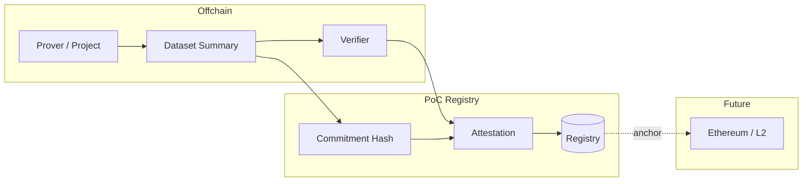

# Carbon MRV Proof of Concept

A minimal proof of concept for **Carbon MRV** (Measurement, Reporting, Verification) that demonstrates:

- **Dataset commitments** — canonical hash of reported data for audit trail
- **Verifier attestations** — signed statement that a dataset was verified (PoC: HMAC; production: EIP-712 or similar)
- **Registry** — append-only list of attestations (PoC: file-based; production: onchain or verified API)

The design is aligned with **cypherpunk** values: **decentralization** (no single registry gatekeeper), **privacy** (raw data offchain; only commitments and attestations in the shared layer), **openness** (open spec and formats), and **transparency** (anyone can verify signatures and commitments). See [Design philosophy](docs/design-philosophy.md).

This repo follows the [EPIC Use Case Template](https://github.com/ethereum/epic-map-app/blob/main/src/lib/useCaseTemplate.ts) for govtech domain use cases.

## Quick start

```bash
npm install
npm run demo
```

The demo will:

1. Create a dataset commitment (hash of a small emissions summary)
2. Create a verifier attestation and sign it
3. Append the attestation to the local registry
4. Confirm the registry has one entry

## Commands

| Command | Description |
|--------|-------------|
| `npm run demo` | Run full flow: commitment → attestation → registry |
| `npm run build` | Compile TypeScript to `dist/` |
| `npm test` | Run tests |
| `npm run spec:view` | Print the specification document |

### CLI (after `npm run build` or with `npx tsx`)

```bash
# Create a dataset commitment
npx tsx src/cli.ts commit "emissions-2024-Q1" '{"period":"2024-Q1","tCO2e":1200,"methodology":"GHG Protocol"}'

# List attestations (optionally filter by project or outcome)
npx tsx src/cli.ts list
npx tsx src/cli.ts list --project proj-001 --outcome verified

# Verify an attestation's signature (paste JSON)
npx tsx src/cli.ts verify '<attestation-json>'
```

## Architecture



- **Prover** (project or operator): Produces a dataset summary (what was measured, period, methodology). The summary is hashed to form a **commitment**; the raw data stays offchain. See [User guide](docs/user-guide.md) for personas and step-by-step flows.
- **Verifier** (accredited body): Reviews the data and creates an **attestation** (verified/rejected) bound to the commitment. The attestation is signed (PoC: HMAC; production: EIP-712 or similar). No central authority is required to verify attestations.
- **Registry**: Stores attestations (PoC: local JSON file; production: onchain or verified API). Multiple registries can coexist; the protocol is open. Optionally anchors a commitment or attestation root onchain for cross-registry reconciliation.

## Repository structure

```
carbon-mrv-poc/
├── README.md           # This file
├── spec/
│   └── README.md      # Formal specification (zkspecs-style)
├── docs/
│   ├── problem-and-research.md
│   ├── value-proposition.md
│   ├── requirements.md
│   ├── architecture.md
│   └── user-guide.md
├── src/
│   ├── index.ts       # Public API
│   ├── types.ts       # Attestation, commitment, registry types
│   ├── commitment.ts  # Dataset commitment (hash)
│   ├── attestation.ts # Attestation create/verify
│   ├── registry.ts    # File-based registry
│   └── cli.ts         # CLI entry
└── package.json
```

## Documentation

| Document | Description |
|----------|-------------|
| [Problem & research](docs/problem-and-research.md) | Problem space (in depth), parties affected, existing solutions and limitations |
| [Value proposition](docs/value-proposition.md) | Why Ethereum / verifiable data fits Carbon MRV; solution required; cypherpunk alignment |
| [Design philosophy](docs/design-philosophy.md) | Decentralization, privacy, openness, transparency (cypherpunk values) |
| [Requirements](docs/requirements.md) | Functional and non-functional requirements |
| [Architecture](docs/architecture.md) | Components and data flow |
| [User guide](docs/user-guide.md) | Personas, parties, step-by-step user flows, running the demo |
| [Specification](spec/README.md) | Formal spec (COSS/zkspecs-style) |
| [Security](docs/security.md) | Threat model, trust assumptions, security considerations and limitations |

## Call to action

- **Pilot partners**: Registries, verifiers, or programs interested in testing attestation and commitment flows — open an issue with label `pilot-interest` or contact the maintainers.
- **Spec feedback**: Open an issue or PR on the [spec](spec/README.md).
- **Code**: See [CONTRIBUTING.md](CONTRIBUTING.md).

## Potential features (out of scope for this PoC)

- Multi-registry reconciliation and double-counting checks
- IoT/sensor data pipeline integration with signed commitments
- Privacy-preserving aggregation for project-level reporting
- Onchain anchoring (commitment or attestation root) to Ethereum or L2
- Alignment with voluntary and compliance carbon standards (e.g. Article 6)

## License

MIT

## References

- [UNFCCC MRV](https://unfccc.int/process-and-meetings/transparency-and-reporting/support-for-developing-countries/consultative-group-of-experts/measurement-reporting-and-verification-technical-material)
- [World Bank: MRV of carbon credits](https://www.worldbank.org/en/news/feature/2022/07/27/what-you-need-to-know-about-the-measurement-reporting-and-verification-mrv-of-carbon-credits)
- [EPIC Use Case Template](https://github.com/ethereum/epic-map-app) — template this PoC follows
