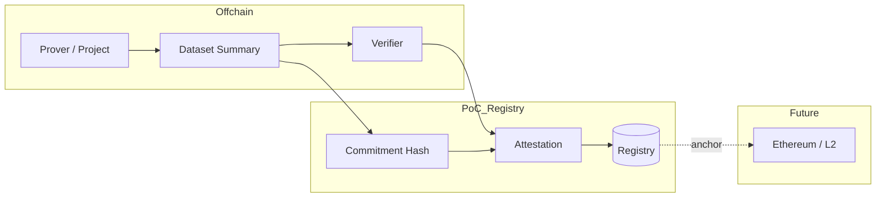
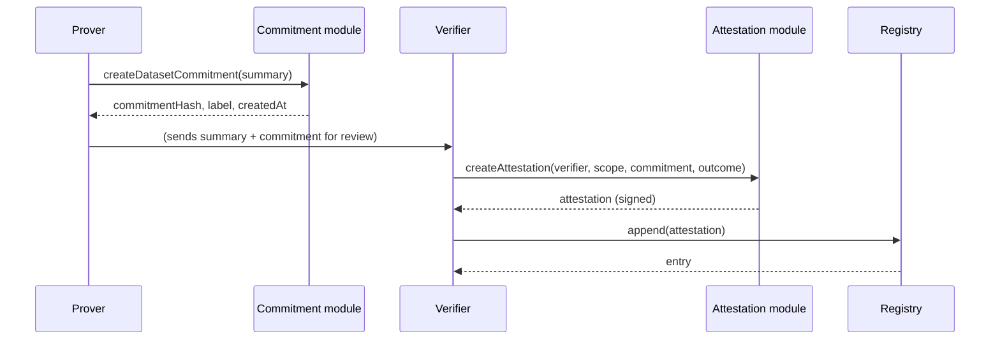

# Architecture diagram and component description

## High-level flow

1. **Prover** (project or operator): Prepares a **dataset summary** (what was measured: period, methodology, key metrics). The system hashes it to produce a **dataset commitment**. Raw data stays offchain.
2. **Verifier** (accredited body): Reviews the data (offchain). Creates an **attestation** (verified/rejected) bound to the commitment and signs it. The attestation is appended to the **registry**.
3. **Registry**: Stores attestations (PoC: local JSON file). Optionally, a commitment or attestation root can be anchored onchain for cross-registry use (future).

## Diagram (Mermaid)

## Component interaction (sequence)

## Components (this repo)

| Component      | File(s)         | Responsibility |
|----------------|-----------------|-----------------|
| **Types**      | `src/types.ts`  | Attestation, DatasetCommitment, RegistryEntry, scope. |
| **Commitment** | `src/commitment.ts` | Canonical serialization, SHA-256 hash, verify. |
| **Attestation**| `src/attestation.ts` | Create attestation, sign (HMAC PoC), verify signature. |
| **Registry**   | `src/registry.ts`   | Append, list (with optional filters), file persistence. |
| **CLI**        | `src/cli.ts`    | Commands: commit, attest, list, verify, demo. |

## Onchain vs offchain

| Element            | PoC location | Production option |
|--------------------|-------------|-------------------|
| Dataset summary    | Offchain    | Always offchain (sensitive). |
| Commitment hash    | Offchain (registry file) | Can be published or anchored onchain. |
| Attestation        | Offchain (registry file) | Can be stored onchain or in verifiable API; root anchored onchain. |
| Registry           | File        | Onchain contract, or offchain DB + onchain root. |

## Design choices

- **Canonical summary**: Sorted keys in JSON so that the same logical summary always yields the same hash.
- **Signature (PoC)**: HMAC-SHA256 with a secret; production should use EIP-712 or similar so verifiers use their own keys.
- **Registry**: Single JSON file for simplicity; production would use a proper store and optionally onchain anchoring.

## Alignment with CROPS and the walkaway test

The architecture is designed to satisfy **CROPS** (Censorship Resistance, Open Source and Free, Privacy, Security) and the **walkaway test** (verification and evolution possible without depending on the PoC authors or a single operator). Multiple registries and implementations can coexist; only commitments and attestations touch the shared layer (privacy); the spec and code are open and forkable (open source and free); and verification is permissionless and reproducible (censorship resistance and security). See [Design philosophy](design-philosophy.md) for the full mapping.
